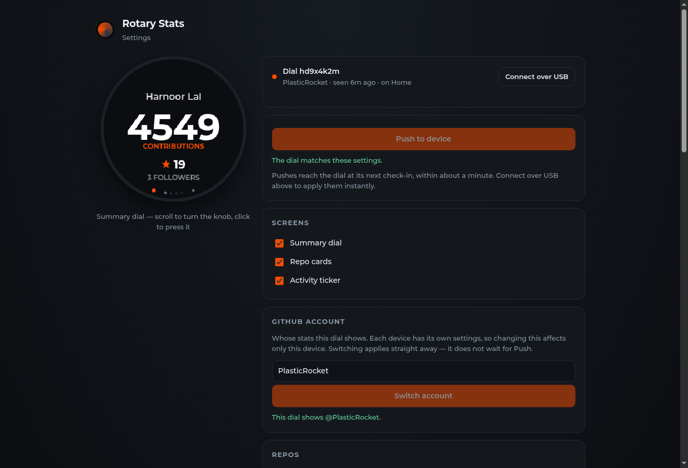
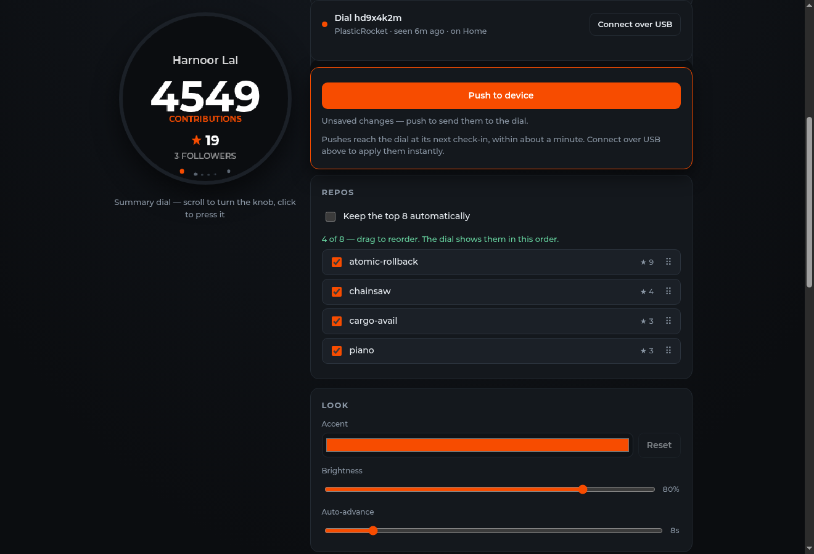

# rotary-screen-customization

[](https://github.com/SuntzuDragon/rotary-screen-customization/actions/workflows/deploy.yml)
[](https://hdog.imcb.dev)
[](firmware/)

GitHub stats on a knob you can spin — for the **Elecrow CrowPanel 1.28" HMI ESP32
Rotary Display**, a 240×240 round IPS panel with a rotary encoder. It has a
touchscreen too, but everything is on the knob.



Set it up from a browser over USB: no phone, no captive portal, no pairing code,
nothing typed twice.

## What it does

**On the dial**

- **Three screens:** a summary (contributions, stars, followers), one card per
  repo — up to eight — and an activity ticker (new stars, PRs, pushes).
- **Turn** to move within a screen, **press** to jump to the next one, **hold**
  for a badge with the dial's id, firmware version and the date it was flashed.
- Auto-advances on a timer you choose, and holds still while the badge is up.
- Pulses its LED when a repo picks up a new star.
- Keeps its last stats in flash, so after a power cut it redraws straight away
  instead of waiting for Wi-Fi to come back.

**On the site** — one page, at [hdog.imcb.dev](https://hdog.imcb.dev)

- A bar at the top names the dial you are editing, when it last checked in and
  which network it is on. It is also the only place the USB cable gets
  connected, and it warns if the cable is in a different dial.
- Screens, repos, accent colour, brightness and auto-advance, previewed live on
  a round mock of the dial and sent together with **Push**. The page takes on
  the accent colour you pick.
- Repos: either the top eight by stars, kept up to date automatically, or a list
  you choose and drag into order.
- **Push with the cable in applies instantly**, and the dial confirms it has the
  new settings. Without the cable they land at its next check-in, within a
  minute.
- **Switch account:** type any GitHub username. Names GitHub does not know are
  refused before anything is saved.
- **Connect GitHub:** one click, read-only, and it renews itself. It covers the
  account's own repos, any private ones it chooses, and any repos an
  organization grants to the app — shown as `org/repo`. A pasted personal access
  token still works as the alternative, for the account's own repos.
- Wi-Fi setup and network changes, over the cable only: the password never
  crosses the internet.
- Firmware flashing from the browser — any published version, with progress and
  a log. Wi-Fi and the dial's identity are kept unless you choose a factory
  reset.
- Before a dial is linked, the same page shows a sample dial with everything
  disabled.



## How it fits together

```
Browser (Web Serial + settings page)          Cloudflare Worker
      |                                         |  D1: devices, settings, cached stats, logs
      | Improv Wi-Fi Serial over USB            |  KV: firmware images
      v                                         |  Cron */5: refresh from GitHub
 [ CrowPanel ] --- HTTPS GET /api/device/:id --->|--> GitHub GraphQL + REST
```

The device never talks to GitHub. The Worker fetches and caches on a fixed
5-minute schedule, so each dial makes one small HTTPS request a minute — usually
answered `304` with no body — and the GitHub token never leaves the server.
While the cable is in, the page can also tell the dial to fetch immediately (a
small addition to the Improv protocol), which is what makes pushes instant.

Everything runs on Cloudflare's free tier. D1 and KV both refuse requests past
their limits rather than billing; R2 was left out because it has no hard spend
cap. The binding limit is Workers requests — 100,000 a day, account-wide — which
is roughly seventy dials at the one-minute poll.

| Path | What |
|---|---|
| `worker/` | Cloudflare Worker: GitHub aggregation, device API, hosts the site |
| `web/` | The settings page: USB setup and flashing, live round-screen preview |
| `firmware/` | PlatformIO / Arduino-ESP32 2.0.14 / LVGL 8.3.11 |
| `docs/` | `context.md` — decisions and why; `research-findings.md` — measured hardware and API behaviour |

## Setup

### 1. Worker

Already deployed. To stand up a fresh copy:

```bash
pnpm install                                        # once, from the repo root
cd worker
pnpm exec wrangler d1 create rotary-stats           # put the id in wrangler.toml
pnpm exec wrangler kv namespace create DEVICES      # firmware images; put the id in wrangler.toml
for f in migrations/*.sql; do pnpm exec wrangler d1 execute rotary-stats --remote --file "$f"; done
pnpm exec wrangler secret put GITHUB_CLIENT_SECRET  # see below
pnpm exec wrangler secret put ENC_KEY               # openssl rand -base64 32
cd .. && pnpm build                                 # the Worker serves web/dist
cd worker && pnpm exec wrangler deploy
```

**The GitHub App.** Register one under GitHub → Settings → Developer settings →
GitHub Apps:

- **Callback URL:** `https://<host>/api/github/callback`, exactly.
- **Expire user authorization tokens:** on — the Worker renews them.
- **Repository permissions,** all read-only: Metadata, Contents, Issues, Pull
  requests. Nothing under organization or account permissions.
- **Webhook:** off. **Installable by:** any account.
- Generate a private key — GitHub requires one before the app can be installed,
  though the Worker never uses it.

Put the Client ID and the app's slug in `wrangler.toml` as `GITHUB_CLIENT_ID` and
`GITHUB_APP_SLUG`, and the client secret in `GITHUB_CLIENT_SECRET`. Until all
three are set, the Connect GitHub button is not offered.

There is **no shared GitHub token.** Every dial fetches with its own connection,
and a dial with none shows *Connect GitHub* until someone connects one. An
optional `GH_TOKEN` secret restores a shared fallback for public data — if you
add one, make it a fine-grained token with Public Repositories (read-only), not a
`gh` CLI token.

`DEFAULT_LOGIN` in `wrangler.toml` is the account a newly set-up dial starts on.
The Worker is bound to `hdog.imcb.dev`; wrangler creates the DNS record on deploy
as long as the zone is in the same Cloudflare account. If you move it to another
domain, re-check the TLS chain — the firmware pins root CAs
(`firmware/include/certs.h`):

```bash
echo | openssl s_client -connect <host>:443 -servername <host> 2>&1 | grep -E 'depth=|issuer='
```

Pushes to `main` that touch `worker/` or `web/` redeploy through
`.github/workflows/deploy.yml`, which typechecks both halves, builds the site and
smoke-tests `/api/health`. It needs a `CLOUDFLARE_API_TOKEN` repo secret with
**Workers Scripts, Workers KV and D1** edit permissions.

### 2. Firmware

Tag a release and CI builds it and publishes it to the Worker, where it appears
in the site's version list:

```bash
git tag -a v0.3.1 -m "..." && git push origin v0.3.1
```

Pushes to `main` that touch `firmware/` build without publishing, as a compile
check. Flash from the site's Firmware card, or locally:

```bash
cd firmware
pio run -e crowpanel128 -t upload --upload-port /dev/ttyACM0
```

`pio run -e crowpanel128-demo` renders a baked-in payload with no Wi-Fi — handy
for working on the dial's UI without a network round trip.

### 3. Set up a dial

1. Plug it into a computer over USB.
2. Open the site in **desktop Chrome, Edge or Opera** — Web Serial is not in
   Firefox or Safari, or on mobile.
3. **Connect over USB** in the bar at the top, and pick the port.
4. In the Wi-Fi card, pick a network from the list the **dial** scanned and enter
   the password.
5. The dial joins, links itself to the page, and the settings unlock.
6. **Connect GitHub** in the Your GitHub card. Until then the dial shows
   *Connect GitHub*.

The browser remembers the link after that, so later changes need no cable. The
dial's settings link (`…/#d=<id>&k=<secret>`) works from any other device.

## Local development

```bash
cd worker && pnpm exec wrangler dev                      # API + built site on :8787
cd web    && pnpm dev                                    # site with HMR, /api proxied to :8787
cd web    && API_ORIGIN=https://hdog.imcb.dev pnpm dev   # site against the live API
```

Put an `ENC_KEY` and a `GITHUB_CLIENT_SECRET` in `worker/.dev.vars`, which is
gitignored. Connect GitHub only completes against the origin registered as the
app's callback, so locally, paste a personal access token instead.

## Gotchas worth knowing

- **Opening the serial port restarts the dial.** Chrome asserts DTR and RTS,
  which are wired to BOOT and EN on this board. The page connects once and keeps
  the port open rather than reconnecting for each action.
- **Linux serial permissions.** Chrome cannot open `/dev/ttyACM0` unless you are
  in the `dialout` group: `sudo usermod -aG dialout $USER`, then log out and in.
- **Web Serial needs HTTPS or localhost.**
- **Setup needs a computer.** Plugged into a wall charger there is no serial host.
- **The dial holds eight repo cards.** That is `kMaxRepos` in the firmware;
  `MAX_DEVICE_REPOS` in the worker and the site must match it.
- **LVGL is pinned to 8.3.11** and Arduino-ESP32 to 2.0.14. LVGL 9 is a breaking
  API change, and the vendor's display glue is written against 8.3.

`docs/context.md` has the reasoning behind the design, and
`docs/research-findings.md` the measurements behind these.
