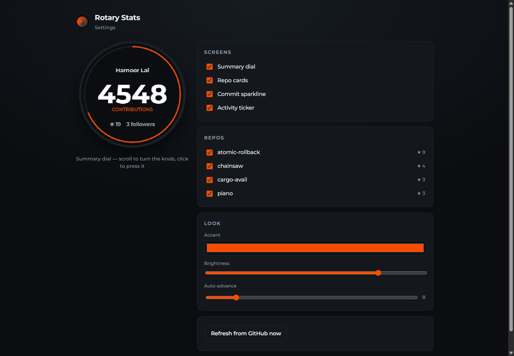

# rotary-screen-customization

GitHub stats dashboard for the **Elecrow CrowPanel 1.28" HMI ESP32 Rotary Display**
— a 240×240 round IPS panel on a rotary knob.

Spin the knob to page through repo stats, press to change screens. Set it up from
a browser over USB: no phone, no captive portal, no pairing code.



## How it fits together

```
Browser (Web Serial + config UI)            Cloudflare Worker
      |                                       |  KV: config, secrets, cached stats
      | Improv Wi-Fi Serial over USB CDC      |  Cron */5: refresh from GitHub
      v                                       |
 [ CrowPanel ] --- HTTPS GET /api/device/:id ->|--> GitHub GraphQL + REST
```

The device never talks to GitHub. A Worker aggregates and caches on a fixed
5-minute schedule, so the device makes one small HTTPS request a minute (usually
answered `304`, zero bytes) and the GitHub token never leaves the server.

| Path | What |
|---|---|
| `worker/` | Cloudflare Worker: GitHub aggregation, device API, static asset hosting |
| `web/` | Browser config UI — USB provisioning and a live round-screen preview |
| `firmware/` | PlatformIO / Arduino-ESP32 2.0.14 / LVGL 8.3.11 |
| `docs/` | Measured API behaviour, and why several design decisions changed |

## Setup

### 1. Worker

```bash
cd worker
npm install
npx wrangler kv namespace create DEVICES     # put the id in wrangler.toml
npx wrangler secret put GH_TOKEN             # fine-grained read-only public-repo PAT
npx wrangler secret put ENC_KEY              # openssl rand -base64 32
cd ../web && npm install && npm run build    # Worker serves web/dist
cd ../worker && npx wrangler deploy
```

Set `DEFAULT_LOGIN` in `wrangler.toml` to the GitHub account to track.

### 2. Firmware

Point the firmware at your deployed Worker, then flash:

```bash
cd firmware
pio run -e crowpanel128 \
  -t upload --upload-port /dev/ttyACM0 \
  # or set DEFAULT_BASE_URL in platformio.ini build_flags
```

`pio run -e crowpanel128-demo` builds a version that renders a baked-in payload
with no Wi-Fi — useful for iterating on the UI without a network round trip.

### 3. Provision

1. Plug the knob into a computer over USB.
2. Open your Worker URL in **desktop Chrome, Edge, or Opera** (Web Serial is not
   in Firefox or Safari, and not on mobile).
3. *Connect device over USB* → pick the port → pick a Wi-Fi network from the list
   the **device** scanned → enter the password.
4. The device connects and hands the browser a URL containing its own id and
   secret. You land on its settings page already authenticated.

## Local development

```bash
cd worker && npx wrangler dev          # API + built UI on :8787
cd web    && npm run dev               # UI with HMR, proxying /api to :8787
```

Put a `GH_TOKEN` and `ENC_KEY` in `worker/.dev.vars` (gitignored).

## Gotchas worth knowing

- **Linux serial permissions.** Chrome cannot open `/dev/ttyACM0` unless you are
  in the `dialout` group: `sudo usermod -aG dialout $USER`, then log out and in.
- **Web Serial needs HTTPS or localhost.** A `workers.dev` URL is fine.
- **The device must be plugged into a computer** to be (re)provisioned. Plugged
  into a wall charger there is no serial host.
- **LVGL is pinned to 8.3.11** and Arduino-ESP32 to 2.0.14. LVGL 9 is a breaking
  API change; the vendor's display and touch glue is written against 8.3.
- **`/stats/commit_activity` answers `202` with an empty body on a cold cache.**
  That is normal, not an error — the sparkline fills in on the next refresh.

See `docs/research-findings.md` for the measurements behind these.
